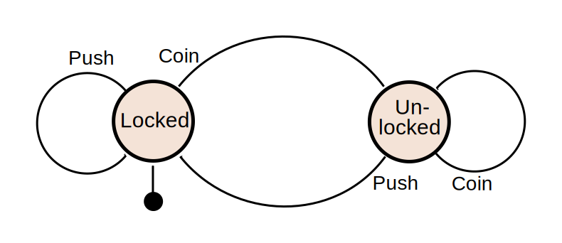

# simple-fsm

is, as the name suggests, a simple finite state machine library that helps with state management.

## How to?

Consider the classic turnstile FSM:



The following code represents this turnstile:

```java
class Turnstile {
    private TurnstileState currentState;

    public Turnstile() {
        this.currentState = TurnstileState.LOCKED;
    }

    public void coin() {
        if (currentState == TurnstileState.LOCKED) {
            currentState = TurnstileState.UNLOCKED;
        }
    }

    public void push() {
        if (currentState == TurnstileState.UNLOCKED) {
            currentState = TurnstileState.LOCKED;
        }
    }
}

enum TurnstileEvent {
    PUSH, COIN
}

enum TurnstileState {
    LOCKED, UNLOCKED
}
```

One of the following two methods can be used for state management:

### Composition

The turnstile class is <em>composed</em> of a the `SimpleStateMachine` and takes care of its entire lifecycle.
All the state related changes and validations are managed by the state machine alone.

```java
class Turnstile {
    private SimpleStateMachine<TurnstileEvent, TurnstileState, Turnstile> stateMachine;

    public Turnstile() {
        stateMachine = SimpleStateMachine.<TurnstileEvent, TurnstileState, Turnstile>builder()
                .initialState(TurnstileState.LOCKED)
                .addTransition(new Transition<>(TurnstileEvent.PUSH, TurnstileState.LOCKED, TurnstileState.LOCKED))
                .addTransition(new Transition<>(TurnstileEvent.COIN, TurnstileState.LOCKED, TurnstileState.UNLOCKED))
                .addTransition(new Transition<>(TurnstileEvent.PUSH, TurnstileState.UNLOCKED, TurnstileState.LOCK))
                .addTransition(new Transition<>(TurnstileEvent.COIN, TurnstileState.UNLOCKED, TurnstileState.UNLOCKED))
                .build();
    }

    public void coin() {
        stateMachine.consume(TurnstileEvent.COIN, this);
    }

    public void push() {
        stateMachine.consume(TurnstileEvent.PUSH, this);
    }
}
```

### Inheritance

Turnstile inherits the `SimpleStateMachine` and routes the state change calls to state machines APIs.

```java
class Turnstile extends SimpleStateMachine<TurnstileEvent, TurnstileState, Turnstile> {
    public Turnstile() {
        super(TurnstileState.LOCKED, buildTurnstileTransitions());
    }

    private static List<Transition<TurnstileEvent, TurnstileState, Turnstile>> buildTurnstileTransitions() {
        List<Transition<TurnstileEvent, TurnstileState, Turnstile>> transitions;
        transitions.add(new Transition<>(TurnstileEvent.PUSH, TurnstileState.LOCKED, TurnstileState.LOCKED));
        transitions.add(new Transition<>(TurnstileEvent.COIN, TurnstileState.LOCKED, TurnstileState.UNLOCKED));
        transitions.add(new Transition<>(TurnstileEvent.PUSH, TurnstileState.UNLOCKED, TurnstileState.LOCK));
        transitions.add(new Transition<>(TurnstileEvent.COIN, TurnstileState.UNLOCKED, TurnstileState.UNLOCKED));
        return transitions;
    }

    public void coin() {
        consume(TurnstileEvent.COIN, this);
    }

    public void push() {
        consume(TurnstileEvent.PUSH, this);
    }
}
```

## Actions

`SimpleStateMachine` supports "actions" to be invoked before and after the state transition takes place. Add custom
actions to be invoked by adding a list of implementations of the `Action` interface.

Consider the following implementation of `Action` which helps us calculate the amount collected by the turnstile.

```java
class AmountCounter implements Action<TurnstileEvent, TurnstileState, Turnstile> {
    @Override
    public void before(ActionContext<TurnstileEvent, TurnstileState, Turnstile> actionContext) {}

    @Override
    public void after(ActionContext<TurnstileEvent, TurnstileState, Turnstile> actionContext) {
        Turnstile turnstile = actionContext.getData();
        turnstile.incrementAmount();
    }
}
```

The `buildTurnstileTransitions` method in the inheritance example will look something like the following:

```java
private static List<Transition<TurnstileEvent, TurnstileState, Turnstile>> buildTurnstileTransitions() {
    List<Action<TurnstileEvent, TurnstileState, Turnstile>> actions = Collections.singletonList(new AmountCounter());
    List<Transition<TurnstileEvent, TurnstileState, Turnstile>> transitions;
    transitions.add(new Transition<>(TurnstileEvent.PUSH, TurnstileState.LOCKED, TurnstileState.LOCKED));
    transitions.add(new Transition<>(TurnstileEvent.COIN, TurnstileState.LOCKED, TurnstileState.UNLOCKED, actions));
    transitions.add(new Transition<>(TurnstileEvent.PUSH, TurnstileState.UNLOCKED, TurnstileState.LOCK));
    transitions.add(new Transition<>(TurnstileEvent.COIN, TurnstileState.UNLOCKED, TurnstileState.UNLOCKED, actions));
    return transitions;
}
```
